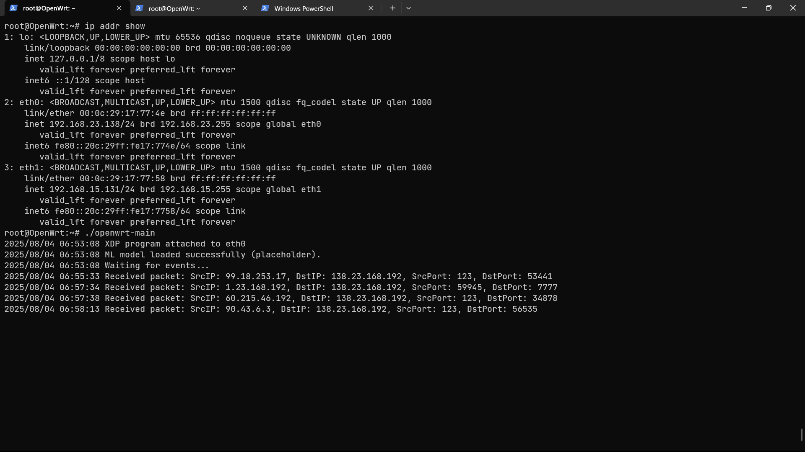

# eBPF Sentinel: SSDP Flood Detection with eBPF and ML
[](https://doi.org/10.5281/zenodo.16792155)

<div style="text-align: justify;">

**eBPF Sentinel** is a program that uses eBPF (extended Berkeley Packet Filter), a feature of the Linux kernel that allows it to run small, safe programs inside the kernel to monitor and extend the kernel's capabilities, without needing to modify the kernel itself. The eBPF program is connected using XDP (eXpress Data Path), a way to process network packets super early, (right when the packets arrive at the computer's NIC).

The tool focuses on detecting SSDP flood attacks, which are a type of denial-of-service (DoS) attack that overwhelms systems by sending too many messages using SSDP. It sends details about suspicious packets from the kernel to a Go program running in normal user space. There, a machine learning model checks if it's an attack. If it is, the malicious IP address is added to a blacklist in the kernel, ensuring subsequent packets from the same IP address are dropped. This follows a "Pseudo zero-trust" approach, where nothing is trusted until it's checked.

The project is built to run on devices like OpenWRT routers, and other resource constrained environements for protecting networks at the edge. It uses C for the kernel-space program (fast and low-level), Go for receiving the data packets and using the ML model to make a verdict. Python was used train and export the ML model.
</div>

## What it does

- **Fast Packet Checking in the Kernel**: Uses XDP to look at packets as soon as they arrive and check if they're from a known bad source using a quick lookup list (an eBPF map).
- **ML for Spotting Attacks**: Pulls out key info from packets (IP addresses, ports, and other attributes) and uses a decision tree model to decide if it's part of a flood attack.
- **Automatic Blocking**: If an attack is detected, it updates the kernel's list to block that source instantly, so the next packets are stopped without extra work.
- **Works on Different Systems**: Thanks to CO-RE (Compile Once - Run Everywhere), the kernel code can adjust to different Linux versions without recompiling.
- **Easy to Run on Routers**: You can build the Go app on your computer to match the router's hardware (like ARM processors) and copy it over.
- **Zero-Trust Security**: Treats every packet as potentially harmful and uses ML to verify it before letting it through.

## Demonstration



> [!NOTE]  
> This project is a very early stage PoC (Proof of Concept) and is not meant for production use by any means. It's meant for research purposes only, to demonstrate how eBPF can be used with machine learning to perform state-of-the-art detection of network attacks on resource constrained environments.

## Prerequisites

- **A \*Nix like Operating System**: Ubuntu / Debian is prefered (tested on Ubuntu 24.04).
- **Go**: Version 1.18 or newer.
- **Clang and LLVM Tools**: For compiling the C code into an eBPF object file.
- **Python 3.8 or Later**: With libraries like scikit-learn and nyoka for training and exporting the ML model.
- **An eBPF enabled (edge) device**: Version 5.10 or higher, with eBPF enabled is required to load and run the eBPF program.


> [!IMPORTANT]  
> Edit the main.go file and replace `eth0` with your network interface name (like `ens33` or `wlan0`) to match your system's configuration, before proceeding ahead with building the program.

## Installation

### Step 1: Get the Code

```bash
git clone https://github.com/yourusername/eBPF-sentinel.git
cd eBPF-sentinel
```

### Step 2: Install Go Dependencies

```bash
go mod tidy
```

### Step 3: Install Tools (on Ubuntu)

```bash
sudo apt update
sudo apt install -y clang llvm linux-headers-$(uname -r)
```

### Step 4: Build the eBPF Object file

```bash
# using makefile
make

# or manually using clang
clang -O2 -g -target bpf -I /usr/include/x86_64-linux-gnu -c eBPF-sentinel.c -o eBPF-sentinel.o
```

### Step 5: Build the go program

```bash
CGO_ENABLED=0 GOOS=linux GOARCH=amd64 go build -o eBPF-sentinel.elf main.go

# Build for an x86_64 architectured OpenWRT router
make openwrt
```


## Usage

### Running on Your Computer

```bash
sudo go run main.go
```

- It connects the program to your network interface (like `ens33`).
- Test by sending fake SSDP packets with a tool like Scapy.
- Watch the logs to see if it detects the malicious packets.

### Putting It on an OpenWRT Router

1. **Build for the Router**:
   ```bash
   GOOS=linux GOARCH=arm64 go build -o eBPF-sentinel.elf main.go
   ```

2. **Copy to the Router**:
   - Transfer the `eBPF-sentinel.elf` file, the eBPF object file, and the ML model file.

3. **Start It**:
   ```bash
   chmod +x ./eBPF-sentinel.elf
   sudo ./eBPF-sentinel.elf
   ```

## How It Works

1. **Kernel Program (in C)**: This runs inside the Linux kernel. It receives incoming packets, checks if it's a UDP packet, and if it is, it sends packet details to the Go app using a special buffer.
2. **Go App**: Loads the kernel program, listens for those details, runs the ML model to check for attacks, and tells the kernel to block malicious IPs.
3. **ML Model**: A decision tree that looks at packet info and decides if it's an attack based on what it learned from training data.


